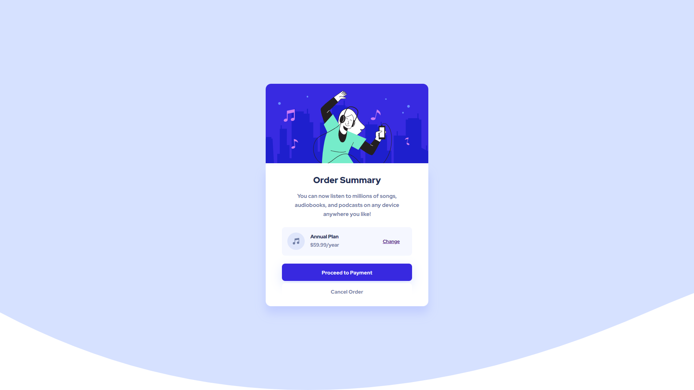

# Frontend Mentor - Order summary card solution

This is a solution to the [Order summary card challenge on Frontend Mentor](https://www.frontendmentor.io/challenges/order-summary-component-QlPmajDUj). Frontend Mentor challenges help you improve your coding skills by building realistic projects. 

## Table of contents

- [Overview](#overview)
  - [The challenge](#the-challenge)
  - [Screenshot](#screenshot)
  - [Links](#links)
- [My process](#my-process)
  - [Built with](#built-with)
  - [What I learned](#what-i-learned)
  - [Continued development](#continued-development)

## Overview

### The challenge

Make an order summary card using the assets provided and try and make it look as close to the design as possible.
The pictures representing the final outcome are in JPEG format, so your own proper judgement is required when 
determining margins, paddings, etc.

Users should be able to:

- See hover states for interactive elements

### Screenshot

I've included two screenshots in the `\screenshots` folder: one for mobile, and one for desktp. 

### Links

- Solution URL: [Add solution URL here](https://www.frontendmentor.io/solutions/mobilefirst-solution-using-bem-naming-convention-Oq6YFDtuU)
- Live Site URL: [Add live site URL here](https://victor-nyagudi.github.io/order-summary-component/)

## My process

I went for a mobile-first approach, which is something I'll probably always be doing, especially for projects
I add to GitHub. 

The HTML came first followed by the styles for the mobile version. Since this project wasn't a big one, 
I didn't need to do much with media queries. Flexbox came in handy with a good chunk of the responsiveness,
so not much extra work was needed to get things to where I wanted them to be. 

### Built with

- Semantic HTML5 markup
- CSS custom properties
- Flexbox
- Google Fonts

### What I learned

The biggest takeaway from this was implementing a design that's already been created using code. Up until a few days
ago, I was practicing CSS with my own "designs", so this gave me a good bit of insight on how things are done in the real world.

It's only my first project, but I hope to add more in future and get better everyday. 
 
### Continued development

One major thing I need to work on is time management. I feel like I spend a lot of time on smaller things that
could've been completed faster.

Again, I'm not worried because speed will come through more and more practice.